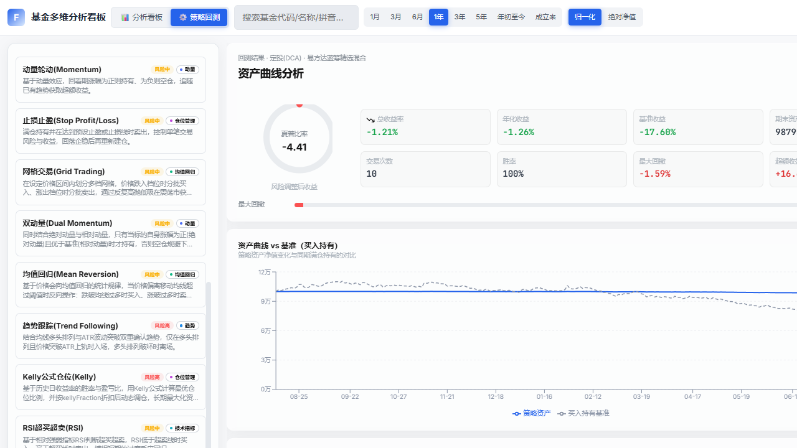
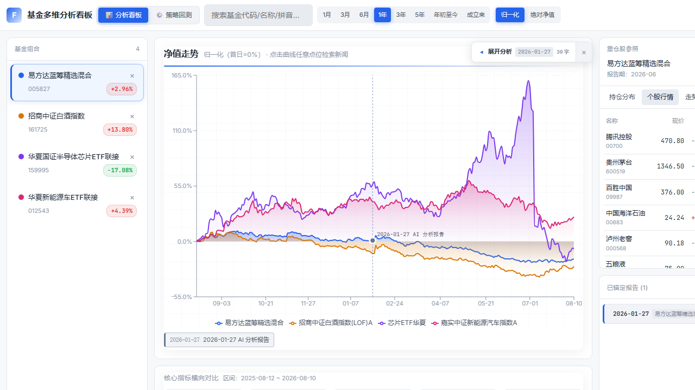
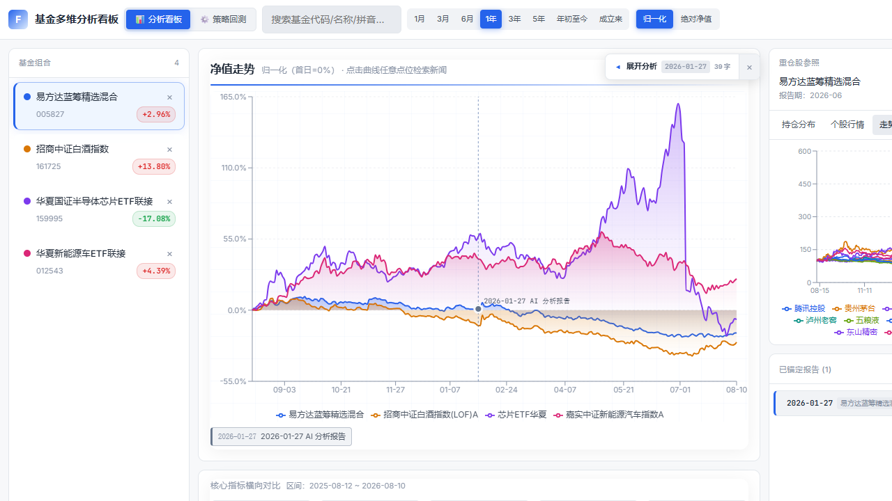
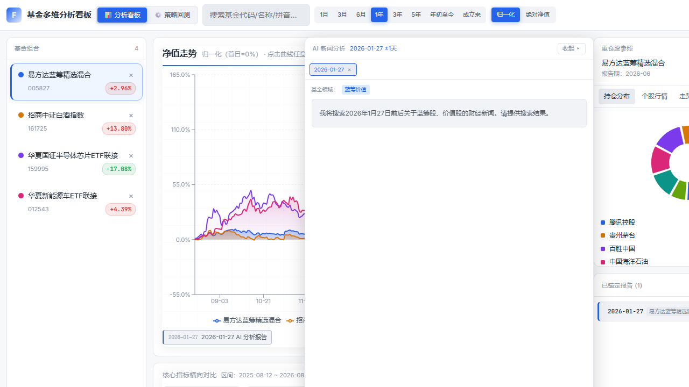
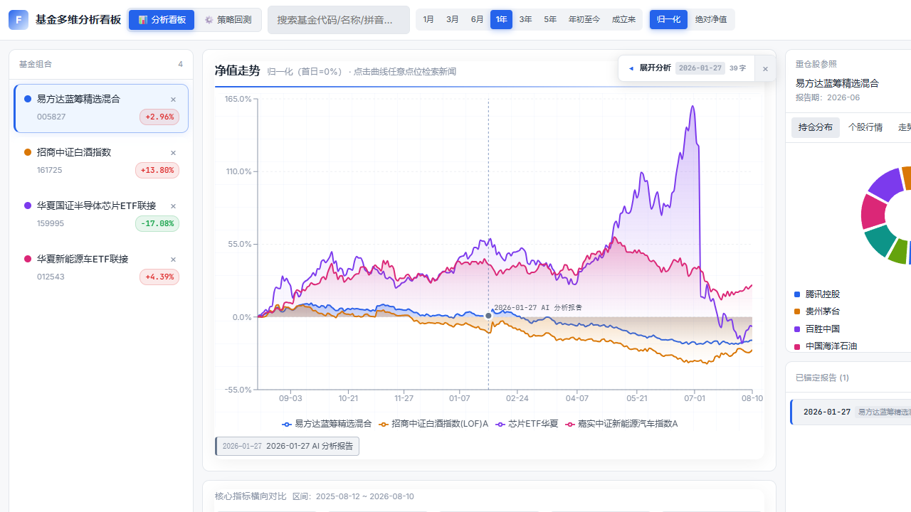
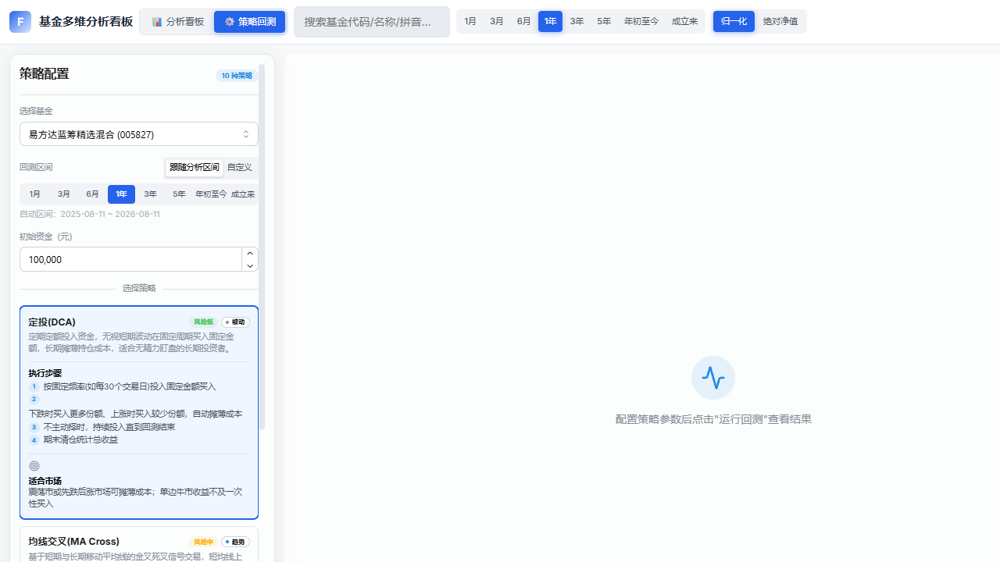
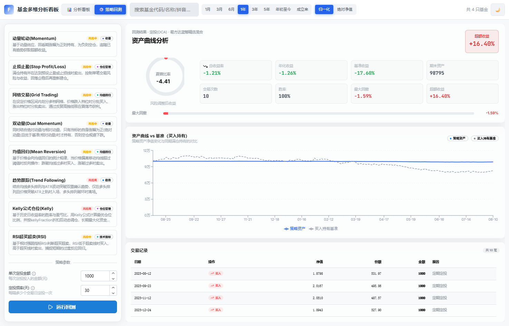

# 基金多维度数据分析看板

全栈基金分析看板，支持多基金净值对比、重仓股参照、**点击净值曲线触发 AI 联网分析**（真 token 流式 + 抽屉对照模式）、分析报告锚定跨期对照、10 种策略回测。



---

## 快速上手

### 1. 启动后端

```bash
cd server
npm install
npm run dev
# 监听 http://localhost:8787
```

**LLM 配置**（AI 新闻分析依赖；后端调用 OpenAI **Responses API** 协议——即 **codex 的接口协议**，经 CC-Switch 以 codex 配置转发，认证由 CC-Switch 完成）：

| 环境变量 | 默认值 | 说明 |
|---------|--------|------|
| `LLM_BASE_URL` | `http://127.0.0.1:15721` | CC-Switch 地址（需启用 codex 端点 `/v1/responses`） |
| `LLM_MODEL` | 空（不指定） | **业务系统不指定模型**，模型一律由 CC-Switch 默认配置决定；仅在需显式覆盖时可设置 |
| `LLM_API_KEY` | 空 | 直连上游时填写；CC-Switch codex 模式无需 |
| `LLM_TIMEOUT` | `60000` | 请求超时（ms） |

> **CC-Switch 要求**：本系统使用 OpenAI Responses API（`/v1/responses`，内置 `web_search` 工具），这是 codex 使用的统一接口。请在 CC-Switch 中按 **codex 配置**添加 provider（启用 codex 端点并指向对应上游模型），后端仅需将 `LLM_BASE_URL` 指向该端点。若 CC-Switch 仅配置了 chat 补全（`/v1/chat/completions`）端点，将无法响应本系统的请求。
>
> **模型选择**：本业务系统**不指定模型**，默认不发送 `model` 字段，由 CC-Switch 的默认模型配置决定。如需思考过程，请在 CC-Switch 端将默认模型配置为推理模型。

**代理配置**（可选；新闻降级链 GDELT/Wikipedia 及保留的翻译接口走境外代理，默认 `socks5h://127.0.0.1:1080`，可通过环境变量覆盖）：

```bash
$env:PROXY_URL="socks5h://127.0.0.1:7890"; npm run dev
```

> LLM 主路径（CC-Switch 本地转发）不走代理；若本机无代理，仅影响 GDELT/Wikipedia 降级链，LLM 分析仍可正常使用。

### 2. 启动前端

```bash
cd client
npm install
npm run dev
# 访问 http://localhost:5173
```

> 前端通过 Vite 代理访问后端 8787 端口。SSE 流式接口在开发环境直连后端，绕过代理缓冲。

---

## 使用流程

### ① 添加基金，查看净值走势

在顶栏搜索框输入基金代码 / 名称 / 拼音，选择后加入基金组合（默认内置 4 只演示基金）。

- **区间切换**：顶栏 8 档区间（1月 / 3月 / 6月 / 1年 / 3年 / 5年 / 年初至今 / 成立来）
- **视图切换**：归一化（首日 = 0%）/ 绝对净值
- **多基金对比**：净值曲线叠加，图例区分颜色
- **核心指标**：区间总收益、年初至今、最大回撤、年化波动率、夏普比率，横向对比并高亮最优值 ★

### ② 重仓股参照分析

右栏"重仓股参照"展示所选基金最新报告期前十大重仓股，三个视图：

| 视图 | 内容 |
|------|------|
| **持仓分布** | 持仓占比环形图 + 明细列表（占净值比） |
| **个股行情** | 实时行情表：现价、当日涨跌、市值、PE（A 股 + 港股） |
| **走势对比** | 十大重仓股归一化走势曲线叠加 |




### ③ 点击净值触发 AI 新闻分析（核心功能）

在净值曲线上**点击任意点位**，右侧滑出 **AI 新闻分析抽屉**（浮动遮挡图表，不挤压布局），AI 联网检索该日期 ±1 天相关财经新闻并撰写分析报告。

**真 token 流式输出**，类 ChatGPT 打字机体验：

1. **思考过程**：折叠区逐字涌现 AI 的推理内容（reasoning token 实时透传，可展开/收起）
2. **联网搜索**：实时显示命中的新闻来源 URL
3. **分析报告**：Markdown 逐字渲染 —— 市场概述 → 重要新闻（含影响判断与原因）→ 综合总结



**抽屉交互**：

- **收起 ▸**：临时收起抽屉回看完整图表（会话状态保留），图表右侧出现胶囊按钮「◂ 展开分析 {日期}」，点击恢复
- **多会话**：连续点击不同点位，会话标签栏累积历史，可切换查看、逐个移除
- **日期联动**：点击报告中的日期标签，图表对应点位高亮闪烁



### ④ 分析报告锚定对照

分析完成后，抽屉底部**锚定按钮**（固定 footer）将整篇报告锚定到对应净值点位：

- 图表上显示锚点标记（竖线 + 圆点 + 标题）
- 右栏"已锚定报告"列表按时间排序，点击展开查看完整分析
- 支持取消锚定，localStorage 持久化，刷新不丢失

### ⑤ 策略回测

顶栏切换到"策略回测"，选择基金、回测区间（默认跟随分析区间）、初始资金，从 **10 种策略**中选择并配置参数后运行回测：

> 定投(DCA)、均线交叉、动量轮动、止损止盈、网格交易、双动量、均值回归、趋势跟踪、Kelly 公式仓位、RSI 超买超卖



回测结果展示策略与基准（期初全仓买入持有）的净值对比曲线、交易记录明细及指标（总收益率、年化收益、最大回撤、夏普比率、胜率、交易次数、基准收益、超额收益）。



---

## 技术栈

- **后端**：Node.js + Express + TypeScript（CommonJS）
  - 数据源：天天基金（pingzhongdata）、腾讯财经行情、LLM(Responses API) / GDELT / Wikipedia / 新浪新闻
  - LLM：OpenAI Responses API 协议（即 codex 接口，经 CC-Switch 以 codex 配置转发），真 token 流式 + reasoning 思考透传
  - 网络：socks5h 代理（**境外数据源**：新闻降级链 GDELT/Wikipedia 及保留的翻译接口走代理，避免 DNS 污染）+ iconv-lite（GBK 解码）
- **前端**：React 18 + Vite + TypeScript + Mantine UI + Recharts
  - Mantine：@mantine/core / dates / hooks（UI 组件库）
  - Recharts：净值/回测曲线图表；dayjs：日期处理；lucide-react：图标
- **持久化**：localStorage（基金列表、视图设置、锚定报告）

## 目录结构

```
claude-design/
├── server/                    # 后端代理服务
│   └── src/
│       ├── config.ts          # 代理/端口/LLM 配置
│       ├── utils/
│       │   ├── cache.ts       # 内存缓存 + sleep
│       │   └── http.ts        # HTTP 工具（按需走代理、GBK、重试）
│       ├── services/
│       │   ├── fund.ts        # 基金搜索/净值/重仓股
│       │   ├── stock.ts       # 个股行情/K线（腾讯）
│       │   ├── llm.ts         # LLM 客户端（Responses API 流式 + reasoning）
│       │   ├── news-llm.ts    # LLM 新闻分析（Markdown 报告 prompt）
│       │   ├── news.ts        # 新闻降级链（GDELT/Wikipedia/新浪）
│       │   ├── sector.ts      # 基金领域推断（生成精准检索关键词）
│       │   ├── backtest.ts    # 回测引擎（10 种策略）
│       │   └── translate.ts   # 翻译接口（保留，前端当前未使用）
│       ├── routes/
│       │   ├── fund.ts
│       │   ├── stock.ts
│       │   ├── news.ts        # SSE 流式新闻接口
│       │   └── backtest.ts
│       └── index.ts           # Express 入口
└── client/                    # 前端 React 应用
    └── src/
        ├── types.ts           # 共享类型（含 NewsSession 会话类型）
        ├── api.ts             # API 客户端（含 SSE 流式消费）
        ├── theme.ts           # 设计系统（亮/暗双主题）
        ├── ThemeContext.tsx   # 主题上下文 Provider
        ├── metrics.ts         # 指标计算（收益/回撤/波动率/夏普）
        ├── storage.ts         # localStorage 持久化
        ├── App.tsx            # 主组件（布局 + 抽屉状态 + 多会话管理）
        ├── main.tsx           # 入口 + MantineProvider + 全局样式
        └── components/
            ├── Header.tsx         # 顶栏（搜索/区间/视图/主 Tab）
            ├── FundList.tsx       # 基金列表
            ├── NavChartPanel.tsx  # 净值曲线（点击检索/锚点/联动高亮）
            ├── MetricsPanel.tsx   # 指标横向对比
            ├── HoldingsPanel.tsx  # 重仓股（饼图/行情/走势）
            ├── NewsDrawer.tsx     # AI 分析抽屉（流式报告 + 多会话 + 日期联动）
            ├── ErrorBoundary.tsx  # 图表渲染错误兜底
            └── BacktestPanel.tsx  # 策略回测
```

## 数据源说明

| 数据 | 接口 | 备注 |
|------|------|------|
| 基金搜索 | eastmoney FundSearchAPI | JSONP 提取 |
| 基金净值 | eastmoney pingzhongdata | 成立来全量，含名称/经理 |
| 重仓股 | eastmoney FundArchivesDatas | JSONP 含 HTML 表格 |
| 个股行情 | 腾讯 qt.gtimg.cn | GBK 编码，A 股+港股 |
| 个股 K 线 | 腾讯 web.ifzq.gtimg.cn | 前复权日线 |
| AI 新闻分析 | LLM Responses API + web_search（codex 协议） | 真 token 流式 + reasoning；经 CC-Switch codex 配置本地转发，不走代理 |
| 新闻降级 | GDELT / Wikipedia / 新浪 | GDELT/Wikipedia 走 socks5h 代理；GDELT 限流严格，三级降级 |

## 已知限制

- LLM 新闻分析依赖 CC-Switch 转发的推理模型；若模型不支持 reasoning，思考过程区为空，仅报告流式输出
- GDELT API 限流严格（连续 2-3 次即 429），通过缓存 + 串行锁 + 三级降级缓解
- Wikipedia "On This Day" 返回历史同日事件（按与目标年份接近度排序）
- 新浪财经滚动新闻仅含近期新闻，作为最终降级
- 港股行情字段与 A 股有差异，已做兼容处理
